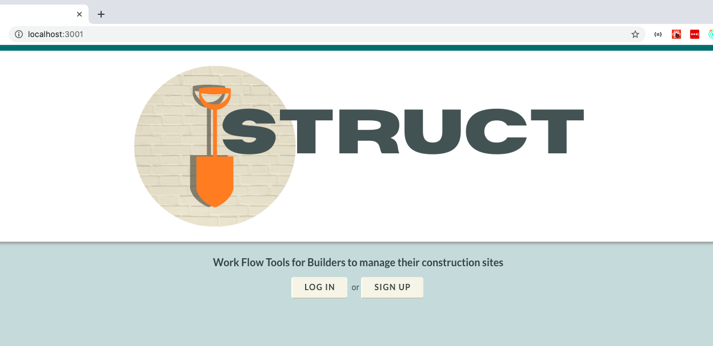
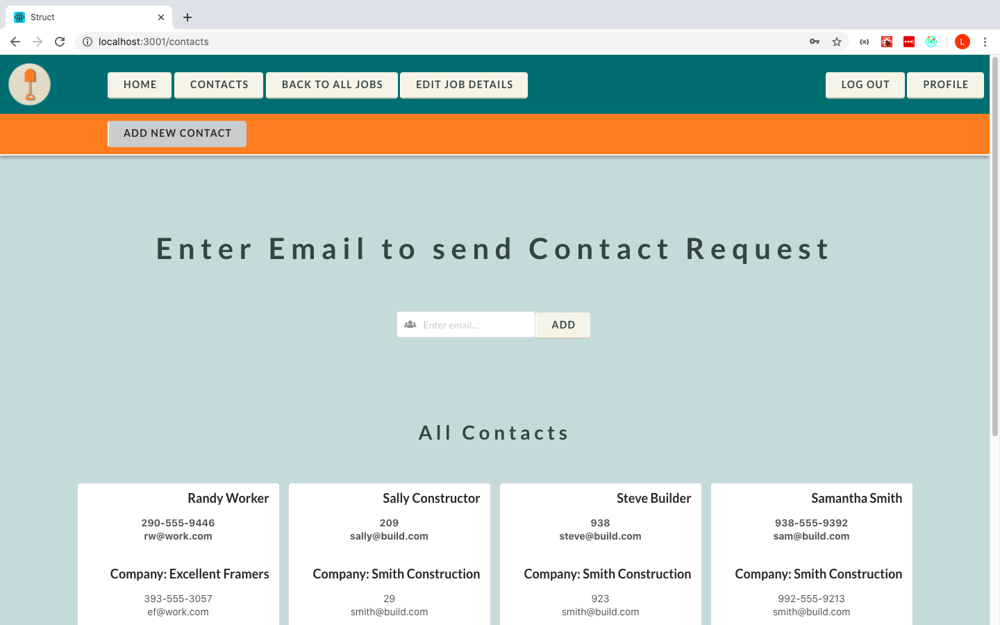
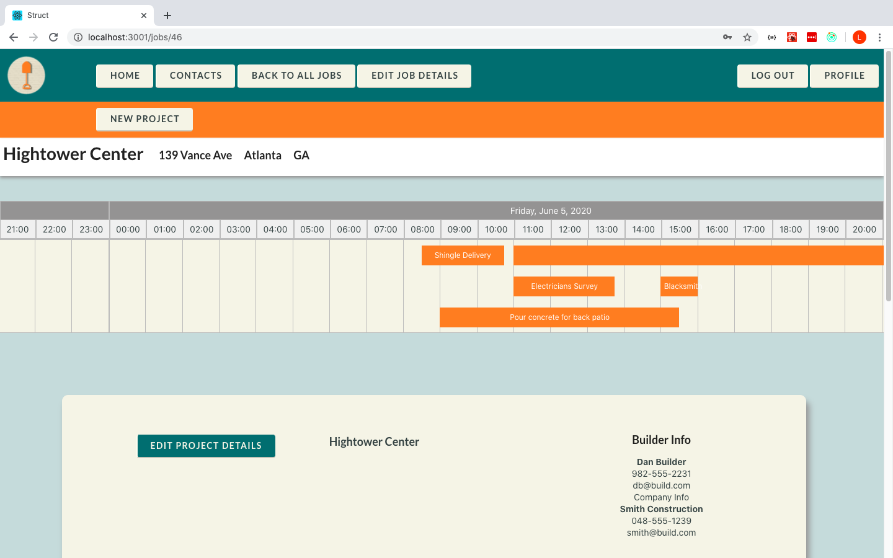
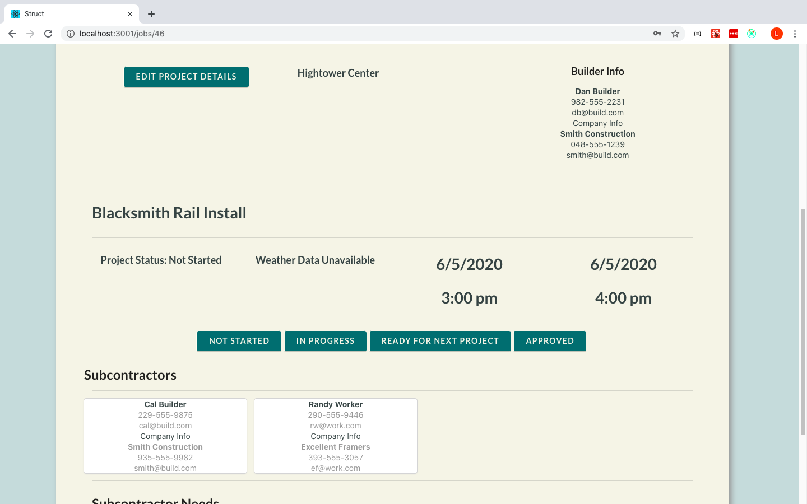

# Struct
A construction site planning tool. Struct makes it easy for builders to plan and coordinate jobs with subcontractors.

View the Struct demo: https://youtu.be/G-Yq-psVJY4

Users can add contacts, and must accept/approve of contact requests before the request will be added to either user's contact list. Contacts are used to add users to a project or job with view or edit privileges.

Each work site is called a "Job". For each job, a timeline is available showing all projects scheduled for that job.

Clicking a project on the timeline will show project details. Certain details are only available to users with project- or job-level permissions. Users with appropriate permissions can also edit from this view.

Struct is also powerful because the timeline itself is interactive, allowing easy navigation, editing, and project creation. See the demo link above to see in action!

If you would like to use Struct, be aware that it is a work in progress, not stable or complete.

1. Fork and clone the Struct repo from Github.
2. cd into STRUCT folder in your terminal
3. You will need one terminal to serve the back end and one to host the front.
    a. in one terminal, cd struct-api and run the command 'rails s'
    b. in a separate terminal, cd struct-client and run the command 'yarn start'. You may specify port 3001 or just select 'y' when asked to use another port.
    **IMPORTANT:** for CORS compatibility, the client must run on port 3001

# Current Features
1. **User Authentication**
2. **Contacts**
    Add a contact by entering email address. This initializes a contact request. Once approved, builders/subcontractors can use their list of contacts to add users to a job or project
3. **Create Jobs**
    Each job site, or collection of tasks to be managed, is called a 'job'. Builders (or any user) may create a job. Each job utilizes a timeline to display all of the projects (sub-task) related to the job.
4. **Project Management**
    Each job can have multiple projects. Each project can be viewed on the timeline, which can be used to view all projects at-a-glance. Clicking a projects opens a box with project details.
5. **Permissions**
    A builder may add contacts to a specific job or project. There are two permission levels: builder/owner, and subcontractor. A user with builder/owner permissions may view/edit all project details, while a subcontractor can only view a few details about each project. A contact may be given permission on a specific project. This will automatically provide view-only permission to a few details on the entire job, but will also allow a subcontractor to see all details of their own project and make selected edits to their own project.

# More features coming! Check again
for features like adding blueprints, messaging, and project dependencies.
